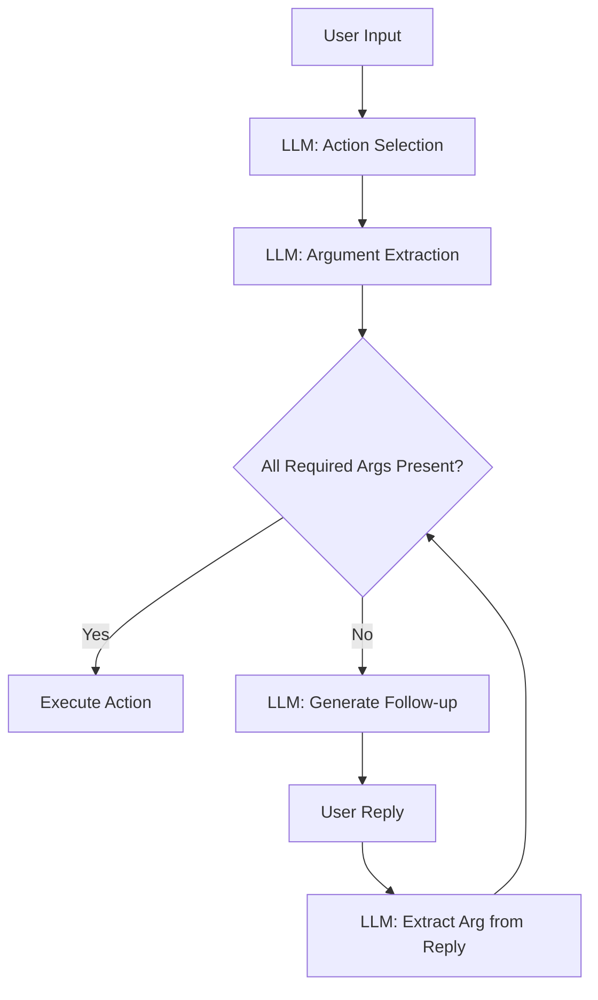

# SAM v2 - LLM-Driven, Schema-Grounded Assistant

A modern, robust, and extensible AI assistant that leverages a language model for natural language understanding, but is always grounded in a system-owned action schema. SAM v2 features modular slot-filling, service integration, and a clear separation of system and LLM responsibilities.

---

## 🚀 Features
- **Schema-Grounded Actions:** All possible actions and their arguments are defined in a system-owned schema (`action_schema.py`).
- **LLM-Driven Understanding:** The LLM is used for action selection, argument extraction, and follow-up question generation, but never invents new actions or arguments.
- **Slot-Filling Orchestration:** The system manages a slot-filling loop, asking for missing arguments as needed, and only executing actions when all required information is present.
- **Service Integration:** Supports Google Calendar, local notes, and todo management via modular service classes.
- **Extensible:** Add new actions or arguments by updating the schema and (optionally) adding a service handler—no LLM retraining required.
- **Separation of Concerns:** System logic (orchestration, state, execution) is cleanly separated from LLM prompt/response logic.
- **Debuggable:** Includes debug prints for LLM responses and argument extraction.

---

## 🧠 Architecture & Workflow

### 1. **Action Schema**
- All actions (intents) and their required/optional arguments are defined in `action_schema.py` as a single `ACTIONS` dictionary.
- Example:
  ```python
  ACTIONS = {
      "create_event": {
          "description": "Create a new calendar event",
          "required_args": ["title", "start_time"],
          "optional_args": ["description", "location"]
      },
      ...
  }
  ```

### 2. **Main Workflow**

#### a. **User Input**
- The user enters a natural language prompt (e.g., "create a new event called studying at 8pm tomorrow").

#### b. **Action Selection (LLM)**
- The orchestrator calls the LLM to select the best action from the schema, given the user prompt.
- The LLM is prompted with the list of available actions and asked to output ONLY the action name.

#### c. **Argument Extraction (LLM)**
- The orchestrator calls the LLM to extract all arguments present in the user prompt for the selected action.
- The LLM is prompted with the action's argument list and a few-shot example, and outputs a JSON object with only the arguments it finds.
- The orchestrator updates the session state with all found arguments.

#### d. **Slot-Filling Loop (System-Orchestrated, LLM-Enhanced)**
- The orchestrator checks for missing required arguments.
- For each missing argument:
  - The LLM is prompted to generate a natural follow-up question (e.g., "What time should I schedule your studying event for?").
  - The user replies (e.g., "8pm tomorrow").
  - The LLM is prompted to extract the value for the missing argument from the reply, using context and few-shot examples.
  - The orchestrator updates the session state.
- This loop continues until all required arguments are filled.

#### e. **Action Execution**
- Once all required arguments are present, the orchestrator calls the appropriate service (calendar, notes, etc.) to execute the action.
- A confirmation message is returned to the user.

#### f. **General Query Fallback**
- If the LLM cannot map the user prompt to any known action, the orchestrator calls the LLM's `generate_general_response` method, which produces a concise, helpful answer to any general or open-ended question.

---

## 🧩 Key Modules

- **`action_schema.py`**: Defines all actions and their arguments.
- **`brain/orchestrator.py`**: Main control loop; manages session state, slot-filling, and action execution.
- **`brain/session_state.py`**: Tracks the current action, collected/missing arguments, and conversation history.
- **`brain/llm_interface.py`**: Handles all LLM prompt/response logic for action selection, argument extraction, and follow-up questions.
- **`brain/execution.py`**: Maps validated actions/arguments to service calls and formats confirmation messages.
- **`services/`**: Contains service modules for Google Calendar, notes, and todo management.
- **`utils/`**: Utilities for config, time parsing, etc.
- **`data/`**: Stores all persistent data (notes, credentials, tokens, etc.).

---

## 🔄 Extensibility
- **Add a new action:**
  1. Add the action and its arguments to `action_schema.py`.
  2. (Optionally) Add a handler in `brain/execution.py` to implement the action logic.
- **Add a new service:**
  - Add a new module in `services/` and call it from `execution.py`.
- **No LLM retraining required:**
  - The LLM is always prompted with the current schema and argument list, so it adapts automatically.

---

## 🛠️ Usage

### **Setup**
1. Install dependencies (see v1/README.md for Python environment setup).
2. Place your Google credentials and token in `v2/data/` if using calendar features.

### **Run the Assistant**
```bash
cd v2
python -m main
```

### **Example Commands**
- `What time is it?`
- `Create a new event called studying at 8pm tomorrow`
- `Show my notes`
- `Create a note about project ideas`
- `Read fun things`
- `Tell me a joke`

---

## 🧠 Slot-Filling Logic (Visual)



---

## 🧪 Debugging & Observability
- All LLM responses and parsed values are printed to the console for transparency.
- If the LLM returns malformed JSON, the system logs the error and continues slot-filling.

---

## 📦 Project Structure

```
v2/
  brain/
    orchestrator.py
    session_state.py
    llm_interface.py
    execution.py
  services/
    google_calendar.py
    notes_service.py
    lightweight_llm.py
  utils/
    config.py
    time_parser.py
  data/
    notes/
    credentials.json
    token.pickle
  action_schema.py
  main.py
  README.md
```

---

## 📝 License
MIT License 